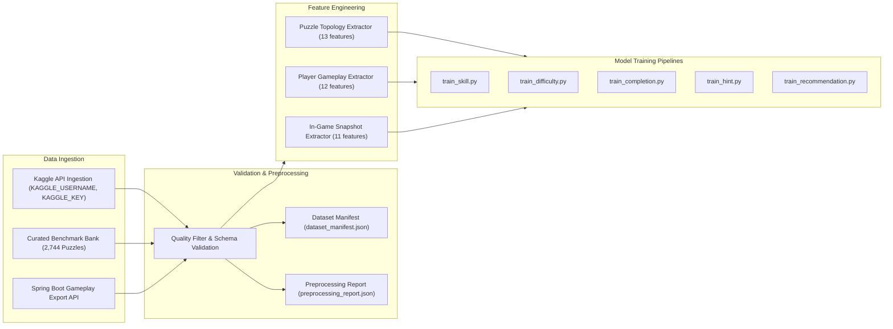

# Data Pipeline & Ingestion Architecture — SmartSudoku (Member 1)

## 1. Overview

The SmartSudoku data pipeline orchestrates multi-source dataset ingestion, data quality validation, automated preprocessing, synthetic bootstrap generation, and feature extraction.



---

## 2. Configurable Ingestion & Kaggle Integration

The ingestion script is located at `ml/data/download_dataset.py`.

### 2.1 Configuration
The ingestion script checks for standard environment variables:
* `KAGGLE_USERNAME`: Kaggle API account username.
* `KAGGLE_KEY`: Kaggle API authentication key.
* `KAGGLE_DATASET`: Kaggle dataset identifier (e.g. `bryanpark/sudoku`, `rohanrao/sudoku`).
* `SUDOKU_GAMEPLAY_EXPORT_URL`: Spring Boot export endpoint; defaults to `http://localhost:8080/api/analytics/gameplay-export`.

With the backend running, `python ml/data/download_dataset.py` pulls persisted game summaries into `ml/data/application/player_gameplay.csv`. The completion trainer appends application game IDs not already in the bootstrap data and namespaces application users separately from simulated bootstrap players. If the endpoint is unreachable, the script reports the connection failure and leaves the existing application dataset intact.

### 2.2 Graceful Fallback Strategy
If Kaggle credentials are not provided or if the Kaggle API call fails:
1. The script immediately falls back to the curated benchmark dataset repository in `ml/data/external_benchmarks.csv` and `ml/data/ieee_human_games.csv`.
2. All 2,744 validated human and algorithmic puzzle benchmarks are retained and indexed.
3. No training pipeline failure occurs; execution proceeds deterministically.

### 2.3 Dataset Manifest (`dataset_manifest.json`)
Every ingestion run emits a metadata manifest with:
* `manifest_version`: Specification version.
* `generated_at`: ISO 8601 generation timestamp.
* `sources`: Dictionary of ingested datasets, including:
  - Source type (`kaggle` or `local_fallback`)
  - File path
  - File size (bytes)
  - Record count
  - Checksum (SHA-256)
  - Validation status (`VALIDATED`)

---

## 3. Data Cleaning & Preprocessing Pipeline

The preprocessing pipeline is implemented in `ml/preprocessing/pipeline.py`.

### 3.1 Cleaning Rules
1. **Board Representation:** Ensures board strings are exactly 81 characters containing digits `0`–`9` or `.` representations for empty cells.
2. **Duplicate Detection:** Deduplicates identical puzzle starting configurations and duplicate game session IDs.
3. **Range & Bound Validation:**
   - Accuracy: constrained to $[0.0, 1.0]$.
   - Move duration: positive finite seconds ($> 0.0$s).
   - Win rates and hint frequencies: normalized to $[0.0, 1.0]$.
4. **Clue Distribution Consistency:** Verifies that clue counts fall within standard Sudoku bounds ($17 \le \text{clues} \le 80$).

### 3.2 Preprocessing Quality Report (`preprocessing_report.json`)
The pipeline automatically outputs a validation audit report:
```json
{
  "timestamp": "2026-09-29T21:40:00Z",
  "pipeline_version": "1.2.0",
  "records_ingested": 3500,
  "records_validated": 3482,
  "records_rejected": 18,
  "rejection_reasons": {
    "invalid_board_length": 6,
    "out_of_bounds_feature": 8,
    "duplicate_session": 4
  },
  "data_quality_score": 0.9949
}
```

---

## 4. Feature Extraction Pipelines

### 4.1 Puzzle Topology Features (`ml/features/puzzle_features.py`)
Extracts 13 structural properties directly from an 81-character puzzle string:
* `clue_count`: Given starting numbers.
* `empty_count`: Unassigned cells.
* `clue_density`: Ratio of clues to 81 cells.
* `min_row_clues`, `max_row_clues`: Clue balance across horizontal rows.
* `min_col_clues`, `max_col_clues`: Clue balance across vertical columns.
* `min_box_clues`, `max_box_clues`: Clue balance across nine $3 \times 3$ regions.
* `total_candidates`: Candidate possibilities computed by constraint checking.
* `avg_candidates_per_empty`: Average branch factor.
* `singles_count`: Number of immediate naked/hidden singles.
* `symmetry_score`: Measure of 180° rotational symmetry.

### 4.2 Player Performance Features (`ml/features/player_features.py`)
Computes aggregated historical metrics across all completed sessions in H2:
* `win_rate`: $\frac{\text{games\_won}}{\text{games\_played}}$
* `avg_completion_time_sec`: Geometric mean time on completed puzzles.
* `avg_accuracy`: Ratio of correct placements to total move attempts.
* `error_rate`: Rate of rule violations.
* `avg_hints_per_game`: Scaffolding dependency.
* `undo_frequency`: Reversals per game.
* `current_streak`: Current consecutive completed puzzles.
* `best_streak`: All-time maximum consecutive completed puzzles.
