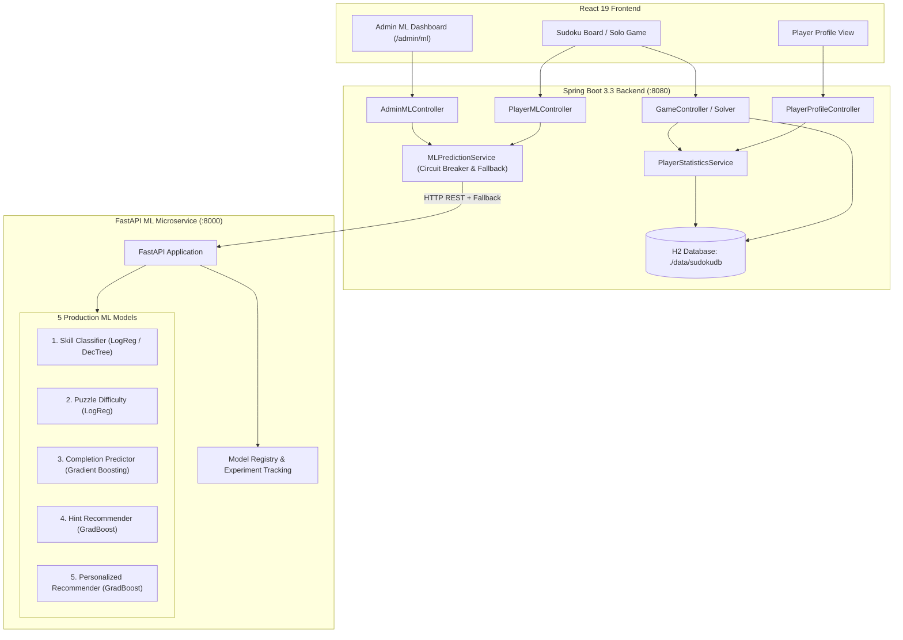

# Machine Learning Architecture — SmartSudoku (Member 1)

## 1. Executive Architecture Overview

SmartSudoku integrates a high-performance **Python FastAPI Machine Learning Microservice** with a **Spring Boot 3.3 Backend** and a **React 19 + TypeScript Frontend**, backed by an embedded **H2 Database** (`jdbc:h2:file:./data/sudokudb`).

---

## 2. Machine Learning Suite (5 Production Models)

| Model Name | Target Prediction | Algorithm | Input Feature Count | Primary Metric |
|---|---|---|---|---|
| **1. Player Skill Classifier** | `BEGINNER`, `INTERMEDIATE`, `ADVANCED`, `EXPERT` | Logistic Regression (L2 regularized) & Decision Tree | 12 gameplay performance features | Test Acc: 0.9556, F1: 0.9554 |
| **2. Puzzle Difficulty Classifier** | `EASY`, `MEDIUM`, `HARD`, `EXPERT` | Logistic Regression (Multinomial) | 13 structural & topological features | Evaluated on 2,744 IEEE + Benchmark Puzzles |
| **3. Puzzle Completion Predictor** | In-game completion probability (0.0 to 1.0) & binary outcome | Gradient Boosting (selected on validation F1) | 9 pre-game and current-state features | Test Acc: 0.8406, weighted F1: 0.8164, ROC-AUC: 0.8148 |
| **4. Pedagogical Hint Recommender** | Scaffolding guidance level (`CELL`, `ROW`, `COLUMN`, `REGION`, `TECHNIQUE`, `NEXT_MOVE`) | Gradient Boosting Classifier | 8 hint context features | Test Acc: 0.6027, F1: 0.6076 |
| **5. Personalized Puzzle Recommender** | Recommended difficulty level adapted to player mastery | Gradient Boosting Classifier | 10 performance trajectory features | Test Acc: 1.0000, F1: 1.0000 |

---

## 3. Detailed Model Specifications

### 3.1 Model 1: Player Skill Classifier
* **Module:** `ml.training.train_skill`
* **Features:** 12 features derived from gameplay history (`win_rate`, `avg_completion_time_sec`, `avg_accuracy`, `error_rate`, `avg_hints_per_game`, `undo_frequency`, `avg_moves_per_second`, `streak_ratio`, `surrender_rate`, `games_completed`, `games_played`, `current_streak`).
* **Artifacts:** `ml/models/saved_models/skill_classifier.joblib`, `skill_classifier_metadata.json`.
* **Telemetry:** Logged in `model_registry.json` and tracked in `experiment_history.json`.

### 3.2 Model 2: Puzzle Difficulty Classifier
* **Module:** `ml.training.train_difficulty`, `ml.features.puzzle_features`
* **Features:** 13 board topology features:
  - `clue_count`: Given clues on starting board
  - `empty_count`: Initial empty cells (81 - clue count)
  - `clue_density`: Ratio of clues to total cells
  - `min_row_clues`, `max_row_clues`: Clue dispersion per row
  - `min_col_clues`, `max_col_clues`: Clue dispersion per column
  - `min_box_clues`, `max_box_clues`: Clue dispersion per 3x3 region
  - `total_candidates`: Total legal candidate values across empty cells
  - `avg_candidates_per_empty`: Mean search branching degree
  - `singles_count`: Immediate naked/hidden singles available
  - `symmetry_score`: 180° rotational board symmetry metric
* **Training Data:** 2,744 real Sudoku boards sampled from IEEE human gameplay benchmarks and benchmark banks.
* **Artifacts:** `ml/models/saved_models/puzzle_difficulty_classifier.joblib`, `puzzle_difficulty_metadata.json`.

### 3.3 Model 3: In-Game Puzzle Completion Estimator
* **Module:** `ml.training.train_completion`
* **Features:** `skill_level_numeric`, `difficulty_numeric`, `historical_completion_rate`, `average_solving_time`, `recent_accuracy`, `current_streak`, `current_progress`, `elapsed_time_ratio`, and `puzzle_complexity_estimate`.
* **Leakage prevention:** Training features for a session use only earlier sessions for that player; current-session final duration, accuracy, hints, and mistakes are excluded. Every player's records stay within one train/validation/test split.
* **Checkpoint limitation:** The bundled gameplay CSV contains session summaries rather than timestamped board snapshots. Training therefore uses standardized progress checkpoints (25%, 50%, 75%) and must not be described as measured move-by-move telemetry.
* **Live integration:** The solo and multiplayer game screens send the current board progress, elapsed time, mistakes, hints, difficulty, and authenticated player's history to `/api/ml/predict/completion`.
* **Artifacts:** `ml/models/completion_model.pkl`, `completion_scaler.pkl`, `completion_metadata.json`, and `completion_confusion_matrix.json`.

### 3.4 Model 4: Pedagogical Hint Recommender
* **Module:** `ml.training.train_hint`
* **Features:** 8 instructional context features (`difficulty_numeric`, `empty_cells_ratio`, `hints_used_so_far`, `error_count`, `time_spent_ratio`, `stuck_duration_sec`, `player_skill_numeric`, `board_symmetry_score`).
* **Output:** Guidance level (`CELL`, `ROW`, `COLUMN`, `REGION`, `TECHNIQUE`, `NEXT_MOVE`) designed to provide minimal scaffolding rather than spoiling the answer.
* **Artifacts:** `ml/models/saved_models/hint_recommender.joblib`, `hint_recommender_metadata.json`.

### 3.5 Model 5: Dynamic Personalized Puzzle Recommender
* **Module:** `ml.training.train_recommendation`
* **Features:** 10 performance trajectory features (`player_skill_numeric`, `recent_win_rate`, `recent_avg_time_ratio`, `recent_error_rate`, `recent_hint_usage`, `current_streak`, `frustration_index`, `boredom_index`, `last_difficulty_numeric`, `completion_momentum`).
* **Output:** Recommended next difficulty level (`EASY`, `MEDIUM`, `HARD`, `EXPERT`) with confidence score.
* **Artifacts:** `ml/models/saved_models/personalized_recommender.joblib`, `personalized_recommender_metadata.json`.

---

## 4. Model Registry & Experiment Tracking

The ML microservice maintains automated lineage and artifact tracking:
* **Registry File:** `ml/registry/model_registry.json`
* **Experiment History:** `ml/registry/experiment_history.json`
* **Prediction Telemetry Log:** `ml/registry/prediction_telemetry.jsonl`
* **Capabilities:**
  1. Inspect registered models, active versions, creation dates, algorithms, and test metrics.
  2. Dynamic version activation without restarting the service (`POST /ml/models/{model_id}/activate`).
  3. Continuous prediction telemetry recording with timestamp, model name, inference latency (ms), and output.
  4. Experiment comparison across hyperparameters, train/validation/test accuracy, F1 score, precision, and recall.

---

## 5. Resilience & Fault Tolerance

1. **Circuit Breaker & Fallback in Spring Boot (`MLPredictionService`):**
   - Configurable timeout (default 2500ms).
   - If the FastAPI service is unreachable or errors, Spring Boot automatically degrades gracefully to deterministic heuristic calculation (e.g. baseline win-rate/accuracy skill estimation or topological difficulty analysis).
   - Telemetry logs errors to console without interrupting gameplay or game submission.
2. **H2 Persistence & Lock Safety:**
   - File mode connection string: `jdbc:h2:file:./data/sudokudb;DB_CLOSE_ON_EXIT=FALSE;AUTO_RECONNECT=TRUE`.
   - `PlayerStatisticsSchemaMigration` dynamically checks and executes pre-Hibernate DDL (`ALTER TABLE player_statistics ADD COLUMN IF NOT EXISTS ...`) on Spring Boot startup.
